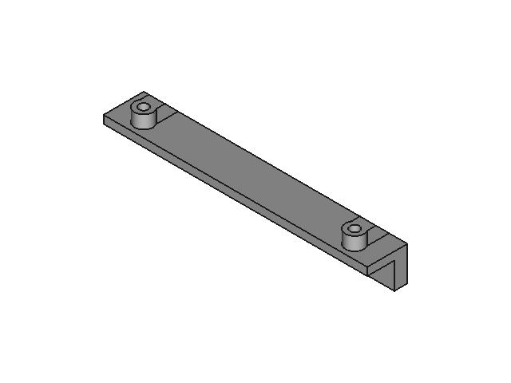
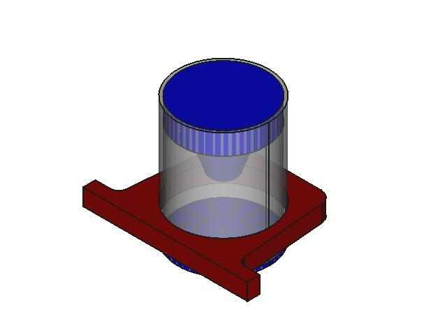
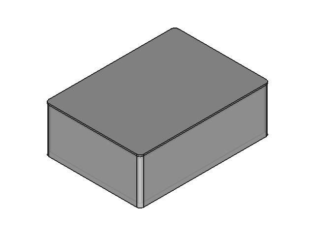
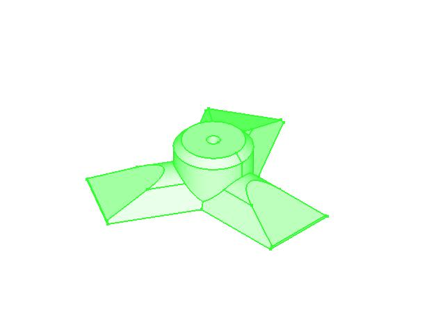
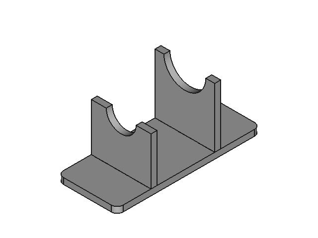

# 3D Designs

Repository to hold all 3D designs.

- [3D Designs](#3d-designs)
  - [Repository structure](#repository-structure)
  - [FreeCAD version](#freecad-version)
  - [Designs](#designs)
    - [hole_jig](#hole_jig)
    - [notebook_cover](#notebook_cover)
    - [paper_briquette_maker](#paper_briquette_maker)
    - [parametric_box](#parametric_box)
    - [pulpropeller](#pulpropeller)
    - [soldering_iron_stand](#soldering_iron_stand)
  - [Notes:](#notes)

---

## Repository structure

<details>
  <summary>Click to expand!</summary>
  
  ```
  ./
  ├── README.md
  ├── docs
  │   └── images
  ├── hole_jig
  │   ├── Images
  │   ├── PDF
  │   ├── STEP
  │   ├── STL
  │   └── hole_jig.FCStd
  ├── notebook_cover
  │   ├── Images
  │   ├── PDF
  │   ├── STEP
  │   ├── STL
  │   └── notebook_cover.FCStd
  ├── paper_briquette_maker
  │   ├── Images
  │   ├── PDF
  │   ├── STEP
  │   ├── STL
  │   └── paper_briquette_maker.FCStd
  ├── parametric_box
  │   ├── Images
  │   ├── PDF
  │   ├── STEP
  │   ├── STL
  │   └── parametric_box.FCStd
  ├── pulpropeller
  │   ├── Images
  │   ├── PDF
  │   ├── STEP
  │   ├── STL
  │   └── pulpropeller.FCStd
  └── soldering_iron_stand
      ├── Images
      ├── STL
      ├── SVG
      ├── exported_parts.FCStd
      └── soldering_iron_stand.FCStd
  ```
</details>

---

## FreeCAD version

<details>
  <summary>Click to expand!</summary>
  
  ```
  OS: Ubuntu Core 20 (ubuntu:GNOME/ubuntu)
  Word size of OS: 64-bit
  Word size of FreeCAD: 64-bit
  Version: 0.19.24276 (Git)
  Build type: Unknown
  Branch: releases/FreeCAD-0-19
  Hash: a88db11e0a908f6e38f92bfc5187b13ebe470438
  Python version: 3.8.5
  Qt version: 5.12.8
  Coin version: 4.0.0
  OCC version: 7.5.0
  Locale: English/United States (en_US)
  ```
</details>


---

## Designs

### hole_jig



Tool to make holes at a certain distance.

### notebook_cover


Notebook sleeve with pen holder

### paper_briquette_maker



Pieces to press paper pulp so a paper briquette can be made. 80mm PVC pipe it is needed so it serve as a container while pressing down to get the water out.

### parametric_box



Parametric box for electronic projects, it uses an spreadsheet to change the size of it.

### pulpropeller



Device to shred paper soaked in water so it gets converted into pulp. It uses a 5mm rod to keep everything in place while mixing.

### soldering_iron_stand



Laser cut soldering iron stand made with 5mm plywood.

---

## Notes:

- Generate repository structure:
  ```
  tree -v -L 2 -I *.FCStd1 ./
  ```
- Grab images
  ```
  tree -i | grep -i OrthographicCamera_ViewAxo_640_480.jpg
  ```
- Remove backup files from repository:
  ```
  rm */*.FCStd[0-9]
  ```
